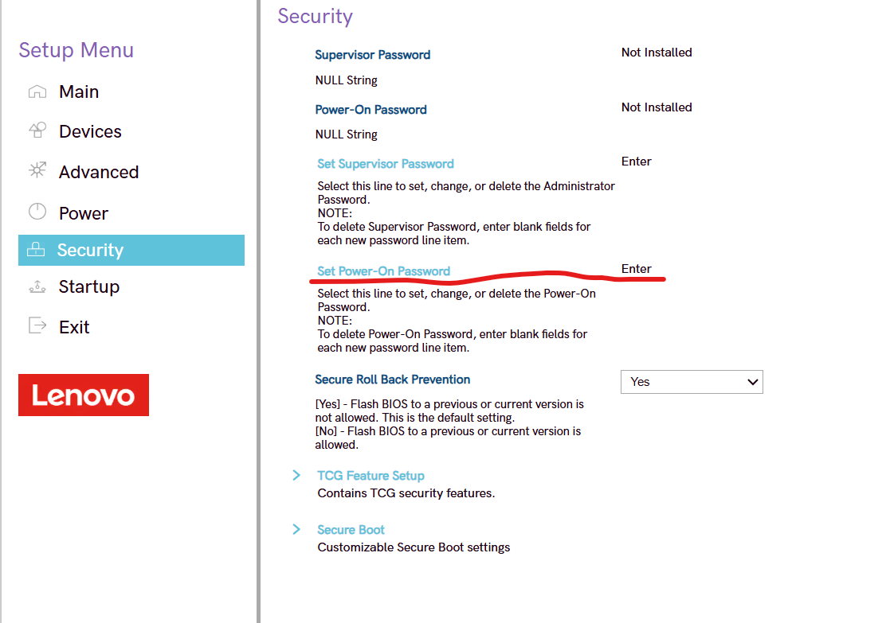
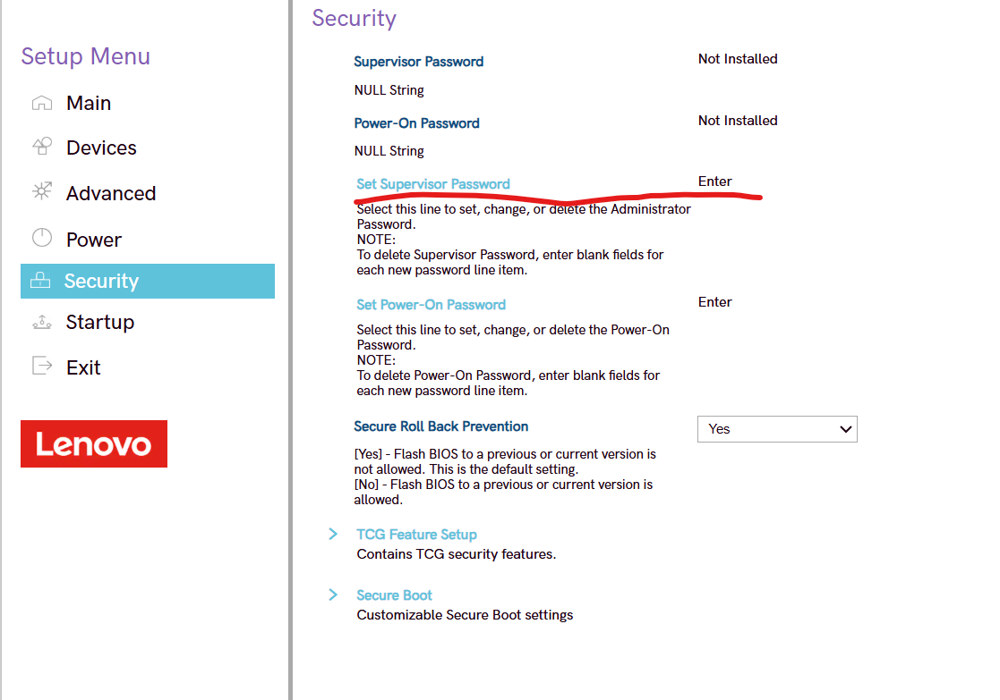
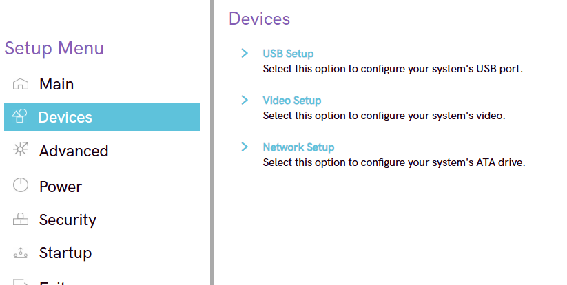
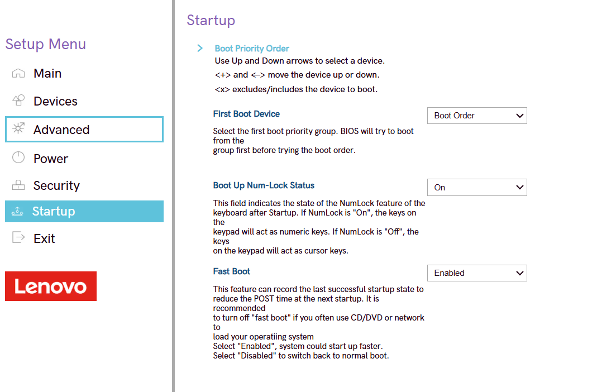
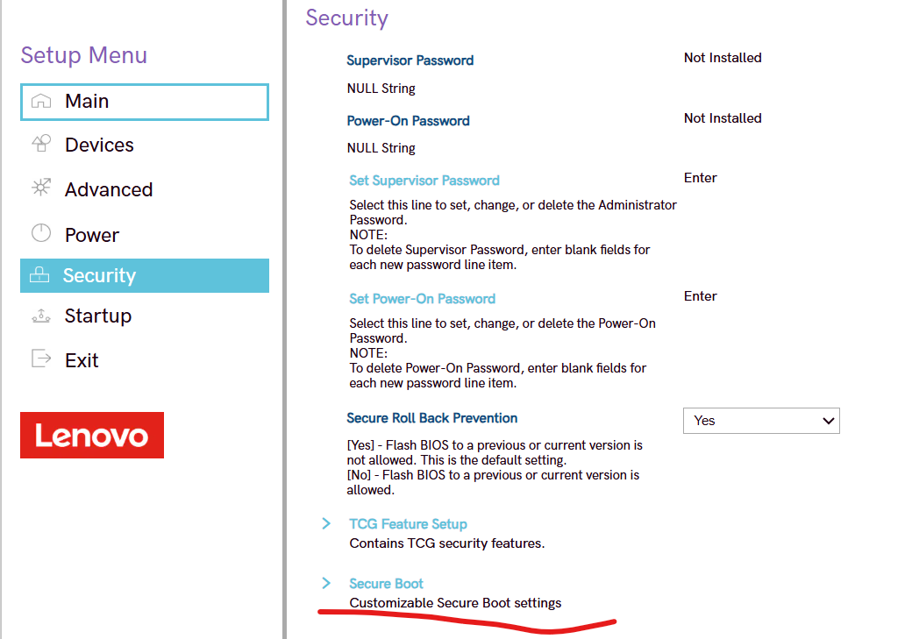
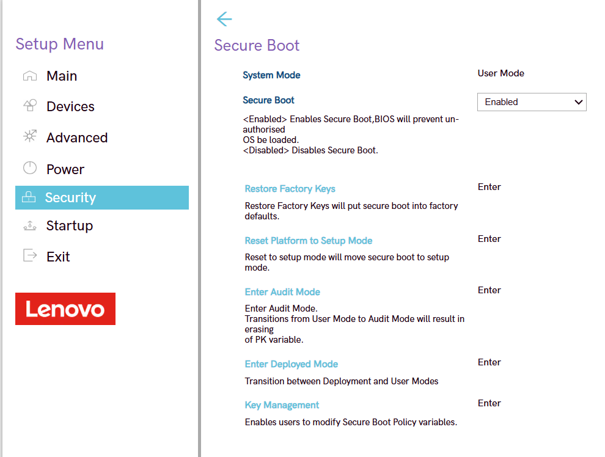
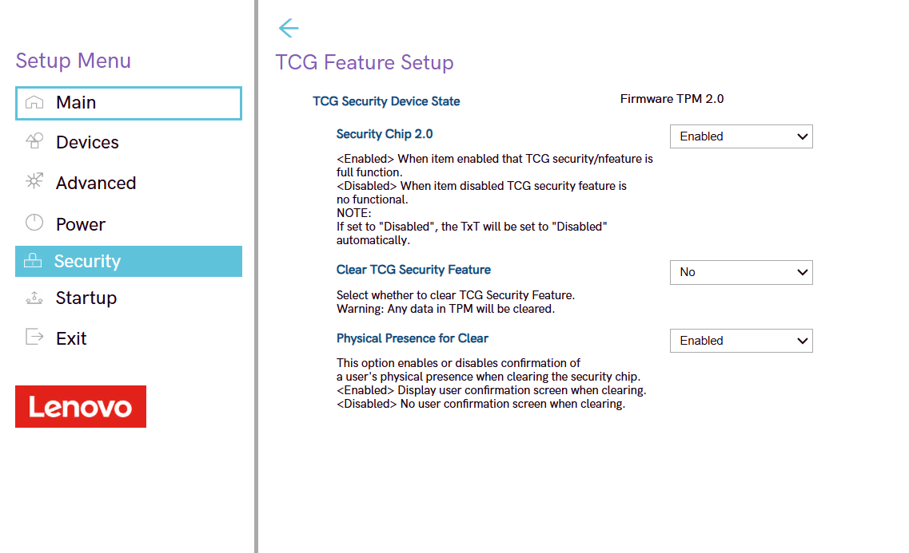
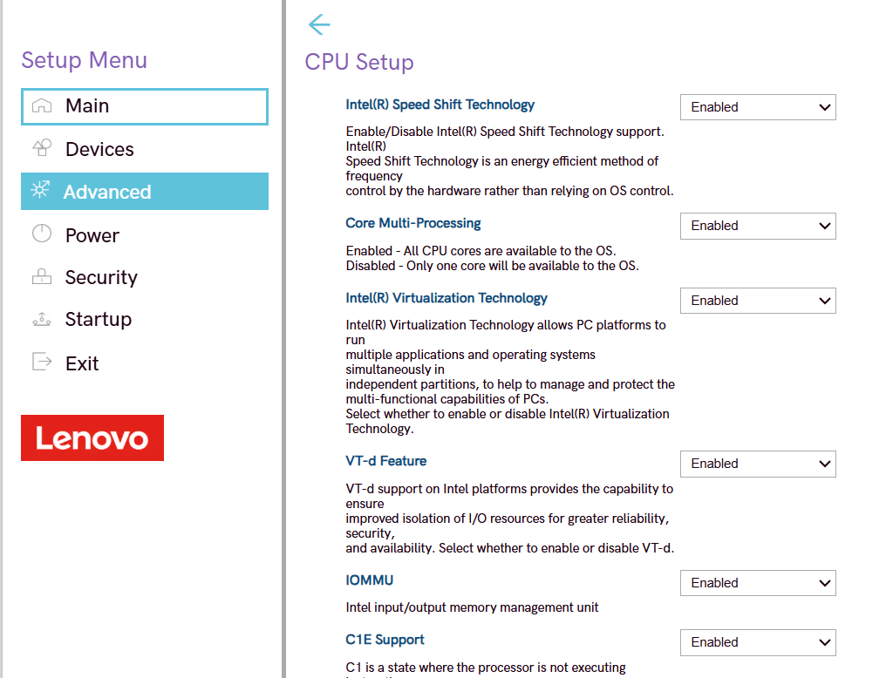
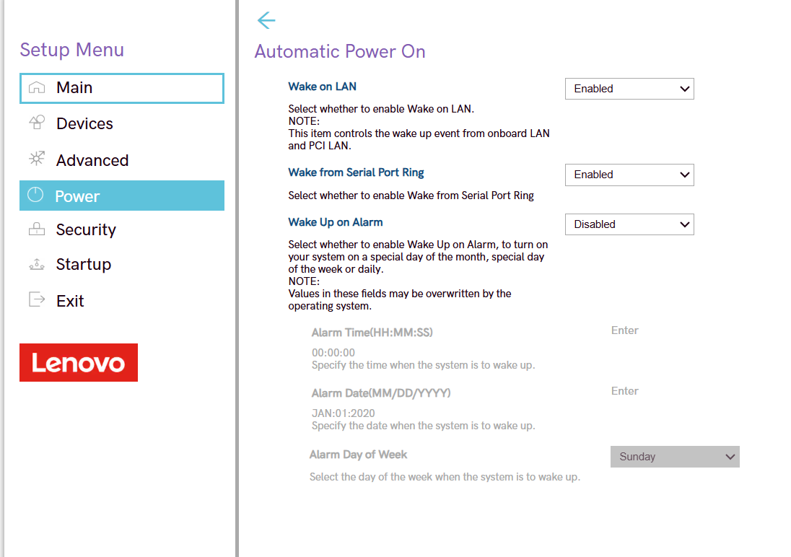

author: Luis Carlos Romero
summary: Guia BIOS/UEFI
id: Guia-BIOS
categories: codelab,markdown
environments: Web
status: Published

# Bastionado de BIOS/UEFI

---

## Paso 1: Establecer contraseña de usuario

### Pasos:

1. Reinicia el equipo y accede a la BIOS/UEFI pulsando la tecla (normalmente `F2`, `DEL`, `ESC` o `F10`).  
2. Busca la sección Seguridad o Contraseña.  
3. Localiza la opción Contraseña de usuario (Power-On Password).  
4. Introduce una contraseña segura (mínimo 10 caracteres, combinando letras, números y símbolos).  
5. Guarda los cambios con `F10` y reinicia.

---

## Paso 2: Configurar contraseña de administrador

### Pasos:

1. Entra en la BIOS/UEFI.  
2. Dirígete a Seguridad -> Establecer contraseña del supervisor.  
3. Introduce una contraseña diferente a la del arranque para mayor seguridad.  
4. Guarda los cambios.

---

## Paso 3: Deshabilitar arranques externos

### Pasos:

1. En el menú principal, entra a Devices -> USB Setup.  
2. Desactiva las siguientes opciones:
   - `USB Boot`
   - `CD/DVD Boot`
   - `Network Boot (PXE)`  
3. Mantén habilitado únicamente el disco duro interno.  
4. Guarda los cambios (`F10`).

---

## Paso 4: Establecer un orden de arranque seguro

### Pasos:

1. Entra en la pestaña Startup -> Boot Priority**.  
2. Configura el orden siguiente:
   1. **Internal HDD/SSD**
   2. **Network (opcional)**
   3. **USB**
   4. **CD/DVD**
3. Guarda los cambios y reinicia.

---

## Paso 5: Activar opciones adicionales de seguridad

### Secure Boot
Security -> Secure Boot

### TPM (Trusted Platform Module)
Security -> TCG Feature Setup

### Desactivar Virtualización (si no se usa)
Advanced -> CPU Setup -> Intel(R) Virtualization Technology

### Desactivar Wake-on-LAN
Power -> Automatic Power On

---
