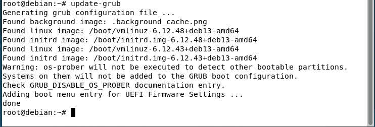
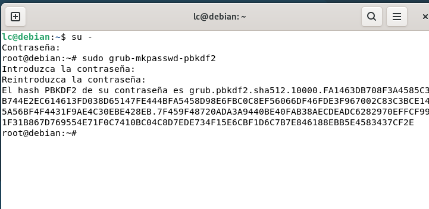
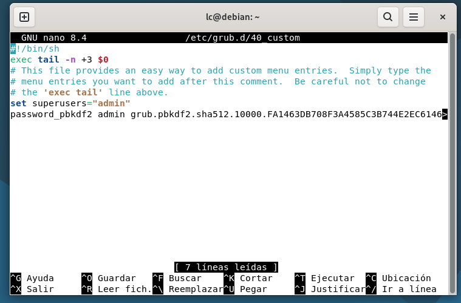
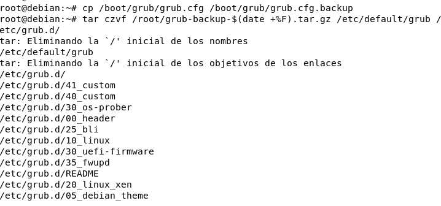

author: Luis Carlos Romero
summary: Guia DEBIAN
id: Guia-DEBIAN
categories: codelab,markdown
environments: Web
status: Published

# Bastionado del arranque en Debian

---

## Paso 1: Ocultar el menú de arranque

### Pasos:

1. Edita el archivo de configuración principal de GRUB:

   sudo nano /etc/default/grub

2. Localiza y modifica las siguientes líneas:

   GRUB_TIMEOUT_STYLE=hidden
   GRUB_TIMEOUT=0   

3. Guarda los cambios (`Ctrl + O`, `Enter`, `Ctrl + X`).

4. Aplica los cambios:

   sudo update-grub   

5. Reinicia el sistema para verificar:

   sudo reboot   

---

## Paso 2: Configurar una contraseña en el GRUB

### Pasos:

1. Genera una contraseña cifrada:
   
   sudo grub-mkpasswd-pbkdf2
   
   Introduce tu contraseña y copia el resultado completo, por ejemplo:
   
   PBKDF2 hash of your password is grub.pbkdf2.sha512.10000.XXXXXXXXXXXXXXXXXXXX

2. Edita el archivo `/etc/grub.d/40_custom`:

   sudo nano /etc/grub.d/40_custom

3. Añade las siguientes líneas (sustituye el hash por el tuyo):
   
   set superusers="admin"
   password_pbkdf2 admin grub.pbkdf2.sha512.10000.XXXXXXXXXXXXXXXXXXXX

4. Actualiza el GRUB:
   
   sudo update-grub

5. Reinicia el sistema. Ahora, si intentas editar opciones de arranque, se solicitará la contraseña.

---

## Paso 3: Crear una copia de seguridad de la configuración del arranque

### Pasos:

1. Copia el archivo principal del GRUB:

   sudo cp /boot/grub/grub.cfg /boot/grub/grub.cfg.backup
   
2. Guarda también los scripts personalizados:
   
   sudo tar czvf /root/grub-backup-$(date +%F).tar.gz /etc/default/grub /etc/grub.d/

3. (Opcional) Copia el archivo a otro medio seguro:
   
   sudo cp /root/grub-backup-*.tar.gz /media/usb/

---

## Paso 4: Aplicar otras medidas de seguridad

### Restringir permisos de /boot

sudo chmod -R 700 /boot

---
